<div align="center">

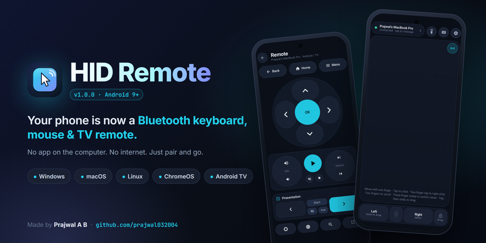

<br/>

# HID Remote

**Turn your Android phone into a real Bluetooth keyboard, touchpad, air mouse and TV remote.**<br/>
No app on the computer. No internet. No ads. Just pair and go.

<br/>

[](https://github.com/prajwal032004/hid-remote/releases/latest)
&nbsp;
[](#-requirements)
&nbsp;
[](LICENSE)


[](https://github.com/prajwal032004/hid-remote/actions/workflows/android.yml)

<br/>

[Features](#-features) · [Screenshots](#-screenshots) · [Install](#-install) · [Connect](#-connect-in-60-seconds) · [Gestures](#-gestures--controls) · [FAQ](#-troubleshooting) · [Build](#-build-from-source)

</div>

---

## 🤔 What is it?

HID Remote uses Android's built-in **Bluetooth HID Device** profile to register your phone as a genuine Bluetooth **keyboard + mouse + media remote**. Your Windows PC, Mac, Linux box, Chromebook or Android TV sees it exactly like a hardware keyboard and mouse, so there's **nothing to install on the computer**: no server app, no Wi-Fi, no account.

<div align="center">
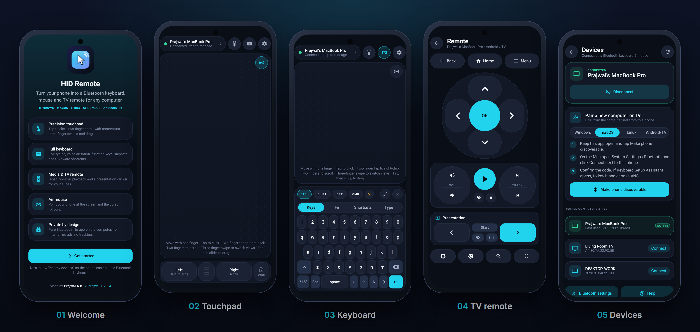
</div>

---

## ✨ Features

<table>
<tr>
<td width="50%" valign="top">

### 🖱️ Precision touchpad
- Velocity-based pointer acceleration, the same at 60, 120 and 240 Hz
- Tap to click: **1 finger = left, 2 = right, 3 = middle**
- Two-finger scrolling with **momentum** and natural/inverted direction
- Tap-and-drag, **drag lock**, hold-to-drag left button
- **Three-finger swipes**: task view, show desktop, switch virtual desktops
- Physical-style buttons with a scroll wheel strip

</td>
<td width="50%" valign="top">

### ⌨️ Keyboards
- Compact panel with **Keys · Fn · Shortcuts · Type** tabs
- Full-size **landscape keyboard** with an optional side touchpad
- **Sticky modifiers**: tap for one-shot, long-press to lock
- **Live typing** mirrors autocorrect, swipe and voice typing as you go
- **Type clipboard** sends the phone's clipboard to the computer
- **Caps Lock** indicator synced from the host

</td>
</tr>
<tr>
<td valign="top">

### 📡 Air mouse <sup>NEW</sup>
- Point the phone at the screen and the **gyroscope moves the cursor**
- Tap the touchpad to click while you point
- Dead-zone filtering removes hand tremor
- Adjustable speed in Settings

</td>
<td valign="top">

### 🔖 Snippets <sup>NEW</sup>
- Save phrases you type all the time: emails, addresses, commands
- **One tap** types them on the computer
- Long-press to delete; up to 30 saved
- Kept when you reset settings

</td>
</tr>
<tr>
<td valign="top">

### 📺 Media & TV remote
- Circular **D-pad** with OK, plus Home · Back · Menu
- Volume and track rockers, play/pause, mute, stop
- Brightness keys, search, full-screen toggle
- **Presentation clicker**: next/prev slide, start, blank, end

</td>
<td valign="top">

### 🧠 Smart & personal
- Shortcuts adapt to **Windows · macOS · Linux · Android TV** (⌘ vs Ctrl and more)
- **Auto-reconnect** to the last computer
- Six accent colours + pure-black **AMOLED** mode
- Left-handed buttons, haptics, keep-screen-on
- Releases Bluetooth when you leave, so nothing runs in the background

</td>
</tr>
</table>

---

## 📸 Screenshots

<div align="center">

| Welcome | Touchpad + Air mouse | Keyboard |
|:---:|:---:|:---:|
| 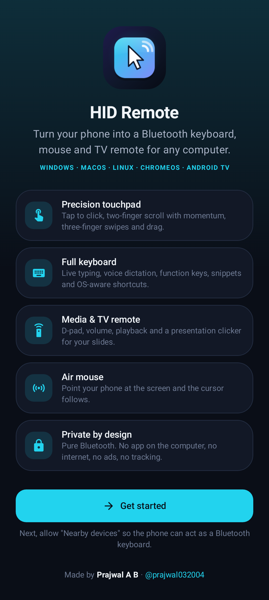 | 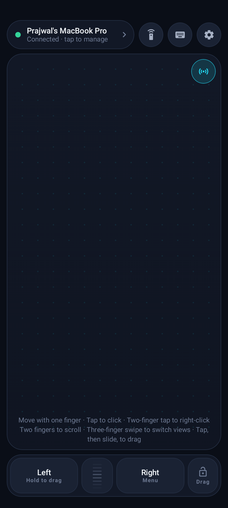 | 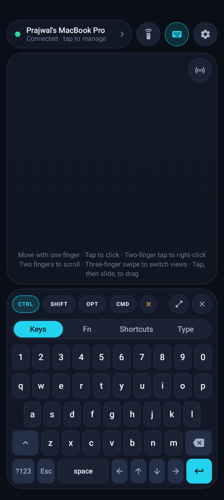 |
| **Snippets & live typing** | **Media & TV remote** | **Devices & pairing** |
| 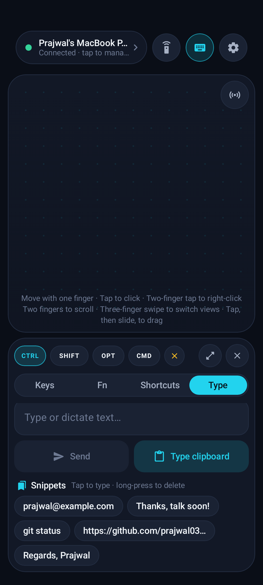 | 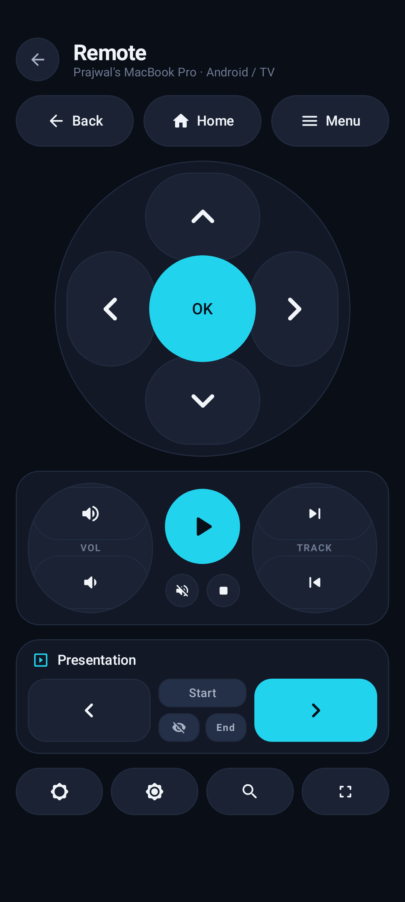 | 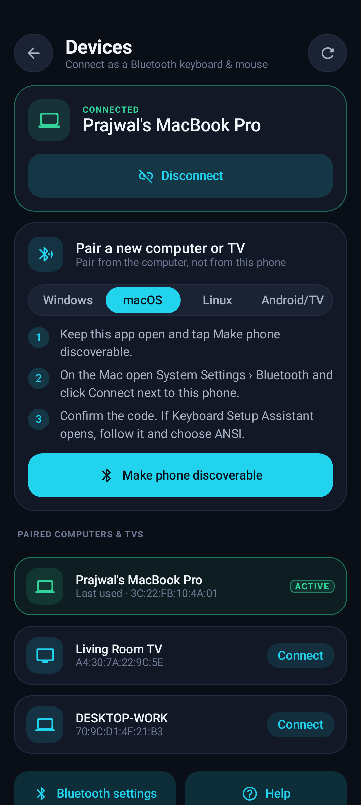 |
| **Settings** | **About** | |
| 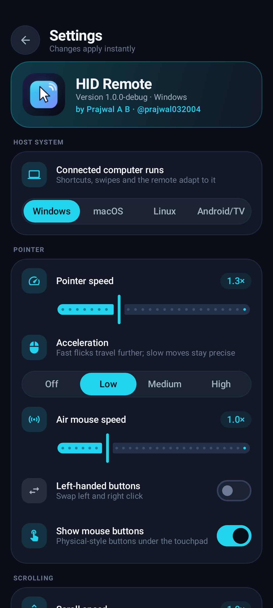 | 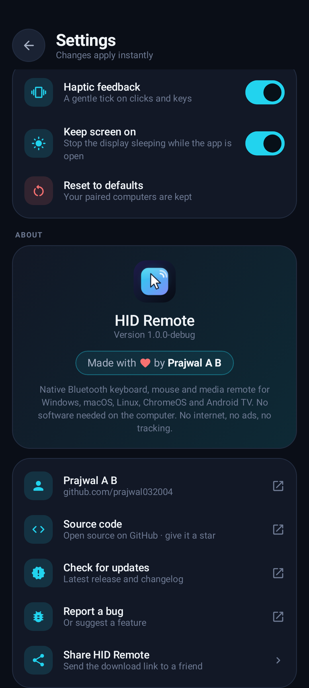 | |

**Full landscape keyboard with side touchpad**

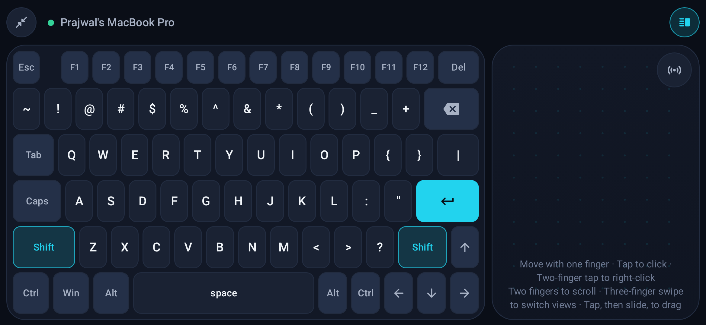

</div>

> Screenshots are rendered from the real Compose UI by the test suite (`ReadmeScreenshotTest`), so they always match the code.

---

## 📥 Install

1. Open the **[latest release](https://github.com/prajwal032004/hid-remote/releases/latest)** on your phone.
2. Download **`HID-Remote-v1.0.0.apk`**.
3. Open it and allow *Install unknown apps* for your browser or file manager when Android asks.
4. Launch **HID Remote**, tap **Get started** and allow **Nearby devices**.

<details>
<summary>🔐 Verify the download (optional)</summary>

```text
SHA-256  e387f71481d29c23bccc21b678dcab4815a84f4d74a083d979b2c94006f285ca
Signer   CN=Prajwal A B, OU=HID Remote, O=prajwal032004
```

On a computer: `sha256sum HID-Remote-v1.0.0.apk` (Linux/macOS) or `certutil -hashfile HID-Remote-v1.0.0.apk SHA256` (Windows).
</details>

### ✅ Requirements
| | |
|---|---|
| **Phone** | Android 9 (Pie) or newer, with Bluetooth. A few manufacturers disable the HID Device profile in firmware; the app tells you if yours is one of them. |
| **Computer / TV** | Anything that accepts a Bluetooth keyboard: Windows 10/11, macOS, Linux, ChromeOS, Android TV / Google TV. |

---

## 🔗 Connect in 60 seconds

> **Important:** pair **from the computer**, not from the phone's Bluetooth menu, so the computer registers the phone as a keyboard and mouse.

1. In HID Remote, tap the status bar → **Devices** → **Make phone discoverable**.
2. On the computer, open Bluetooth settings and add a new device:
   - **Windows:** Settings › Bluetooth & devices › Add device › Bluetooth
   - **macOS:** System Settings › Bluetooth › *Connect* next to your phone
   - **Linux:** your desktop's Bluetooth panel, or `bluetoothctl` → `scan on` → `pair <MAC>`
   - **Android TV:** Settings › Remotes & Accessories › Add accessory
3. Confirm the pairing code on both screens. Done! Next time the app reconnects automatically.

---

## 👆 Gestures & controls

| Gesture | Action |
|---|---|
| One finger move | Move pointer |
| Tap | Left click |
| Two-finger tap | Right click |
| Three-finger tap | Middle click |
| Two-finger drag | Scroll (flick for momentum) |
| Tap, then touch again and slide | Drag (select text, move windows) |
| Three-finger swipe ↑ / ↓ | Task view / Show desktop |
| Three-finger swipe ← / → | Switch virtual desktop |
| 📡 button (top-right of pad) | Toggle **air mouse** |
| Modifier chip tap / long-press | One-shot / Lock (Ctrl, Shift, Alt/Opt, Win/Cmd) |

---

## 🛠️ Troubleshooting

<details>
<summary><b>Windows pairs, but the mouse and keyboard do nothing</b></summary>

Windows reads the keyboard/mouse profile only while pairing. Remove the phone in *Bluetooth & devices*, then in the app tap **Devices › Make phone discoverable** and add it again **from the PC**. The first connection can take up to 30 s while Windows installs drivers.
</details>

<details>
<summary><b>It disconnects on its own</b></summary>

When you leave the app, Bluetooth is released after one minute so nothing runs in the background, and it reconnects when you return. To stay connected while using other apps, turn on **Settings › Stay connected in background**.
</details>

<details>
<summary><b>Wrong characters are typed</b></summary>

The app types like a **US English** keyboard. Set the computer's keyboard layout to English (US).
</details>

<details>
<summary><b>Shortcuts do the wrong thing</b></summary>

Pick the right system in **Settings › Host system**. Copy/paste, app switching, swipes and the remote all adapt to it.
</details>

<details>
<summary><b>My phone's own Bluetooth keyboard or controller stopped working</b></summary>

While HID Remote acts as a keyboard, Android pauses the phone's *own* Bluetooth keyboards, mice and game controllers (headphones and watches are unaffected). Leave the app and they work again within a minute.
</details>

<details>
<summary><b>"Not supported" on my phone</b></summary>

The Bluetooth HID Device profile is part of Android since 9.0, but some manufacturers switch it off in firmware. There's no workaround on those devices.
</details>

More answers are built into the app under **Settings › Help & troubleshooting**.

---

## 🔒 Privacy

- **No INTERNET permission**: the app physically cannot send data anywhere.
- No analytics, no ads, no accounts. Settings are stored only on your phone.
- Permissions: *Nearby devices* (Bluetooth) and *Vibrate* (haptics). That's it.

---

## 🏗️ Build from source

**Requirements:** a recent Android Studio (with Android Gradle Plugin 9 support) or the command line with **JDK 17+** (JDK 21+ to run the Robolectric screenshot tests) and the Android SDK 36.

```bash
git clone https://github.com/prajwal032004/hid-remote.git
cd hid-remote

./gradlew assembleDebug           # debug APK  → app/build/outputs/apk/debug/
./gradlew testDebugUnitTest       # unit + UI tests (needs JDK 21+)
./gradlew recordRoborazziDebug    # regenerate README screenshots
```

<details>
<summary><b>Signed release build</b></summary>

Create `keystore.properties` in the project root (it is git-ignored):

```properties
storeFile=C:/path/to/your-release.jks
storePassword=••••••
keyAlias=hidremote
keyPassword=••••••
```

Then run `./gradlew assembleRelease`. The output is a minified, resource-shrunk APK in `app/build/outputs/apk/release/`. In CI you can set `KEYSTORE_PATH`, `STORE_PASSWORD`, `KEY_ALIAS` and `KEY_PASSWORD` environment variables instead.
</details>

### Project structure

```text
app/src/main/java/com/example/
├── bluetooth/   BluetoothHidManager: HID profile registration, connect/reconnect state machine
├── hid/         HID report descriptors, key maps and the paced report sender
├── input/       PointerAccelerator, GyroPointer (air mouse), ScrollAccumulator, TextDiff
├── model/       UserSettings, SettingsRepository, HostOs shortcut tables, AppInfo
├── viewmodel/   HidRemoteViewModel: single source of truth for the UI
└── ui/          Jetpack Compose screens, components and theme
```

**Tech:** Kotlin · Jetpack Compose · Material 3 · Coroutines/Flow · Android `BluetoothHidDevice` API · Robolectric + Roborazzi screenshot tests · R8.

---

## 🤝 Contributing

Bug reports and ideas are welcome. Please [open an issue](https://github.com/prajwal032004/hid-remote/issues) with your phone model and host OS. Pull requests are welcome too: run `./gradlew testDebugUnitTest` first.

If HID Remote is useful to you, **please ⭐ star the repo**. It really helps!

---

<div align="center">


**Made with ❤️ by [Prajwal A B](https://github.com/prajwal032004)**

[](https://github.com/prajwal032004)

<sub>Released under the <a href="LICENSE">MIT License</a>.</sub>

</div>
